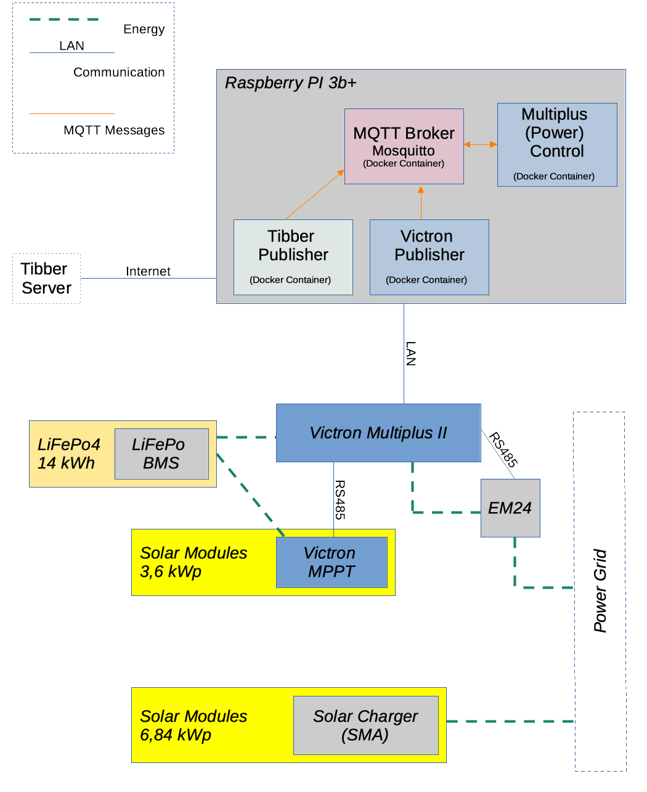
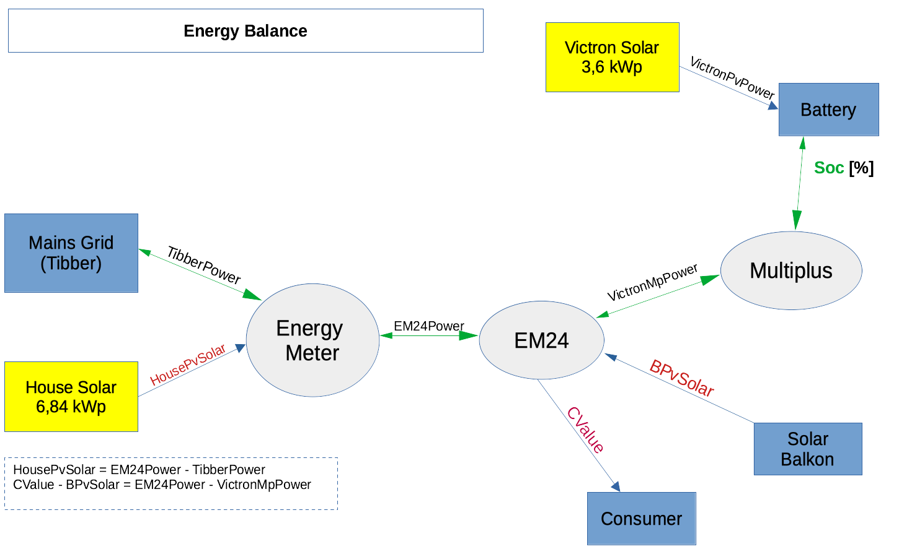

# Home Automation
This project represents the home automation control running on Raspberry PI for a configuration based on 
- LiFePo battery and balancer
- multiple solar chargers
- Victron Multiplus (in ESS mode)

A special condition is the fact that the "House Solar" system was created in 2008. The related SMA inverter are not able to communicate with the rest of system. Therfore, the current amount of solar production must be derived from grid meter and EM24 measurement.

[ToDo's](doc/todos.md)
## Goal
The main goal is to minimize the necessary amount of energy (and price) being delivered by my energy provider. To achieve this, the algorithm is following these rules:
1. Use solar energy as much as posssible.
2. Prefer the smaller solar system over the bigger one
3. If the available solar energy isn't sufficient, check Tibber's price forecast and use it for battery charging
  
   
## Overview
### System overview

### Energy Measurements

## Preconditions
### Docker
The docker container must be created locally. Therefore, docker must be installed on
- on your host to build the docker images for your Raspberry PI
- on your target system (Raspberry Pi)
  
[This page](https://www.schaerens.ch/raspi-setting-up-mosquitto-mqtt-broker-on-raspberry-pi-docker/) gives some tips to prepare your Raspberry Pi for Docker & MQTT.

### Docker Hub
You need a Docker Hub account to push your created docker images; and to pull them onto your Raspberry Pi.

## Installation

### 1. Clone
Clone or Update from git via:
`git clone git@github.com:avenqo/homeauto2.git`
or
`git pull origin`

### 2. Create docker images, push to Dockerhub
- [Mosquitto Broker](./doc/mosquitto.md)
- [Multiplus Control](./doc/multiplus_control.md)
- [Victron Publisher](./doc/victron_publisher.md)
- [Tibber Publisher](./doc/tibber_publisher.md)

## Components
The system consists of 4 docker containers running on Raspberry Pi 3b+.
### Mosquitto (MQTT Server)
The MQTT server is the information broker in the middle of the system.
Installation and configuration is [explained here](./doc/mosquitto.md).

### Multiplus (Power) Control
Takes the values from MQTT Broker and recalculates the power flow for *Victron Multiplus II*(meaning: inverter or charger mode), depending on power balance. 
[read more](./doc/multiplus_control.md)

### Victron Publisher
Reads the value from Victron Multiplus, Victron MPPT charger and EM24 and publish them on MQTT Broker.
[read more](./doc/victron_publisher.md)

### Tibber Publisher
- Opens a websockert connection via [Tibber API](https://developer.tibber.com/docs/guides/calling-api)
- receives the power consumption and production values
- publishes the values on MQTT Broker.
[read more](./doc/tibber_publisher.md)

