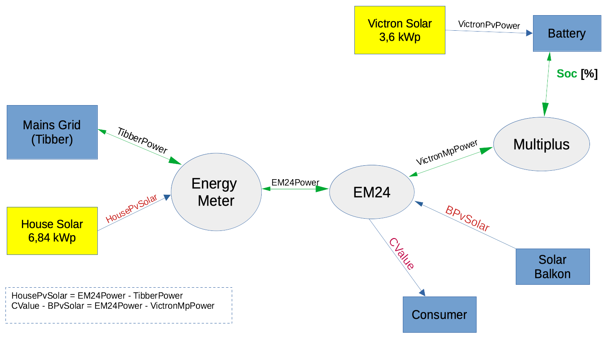

# Home Automation
This project represents the home automation control running on Raspberry PI for a configuration based on 
- LiFePo battery and balancer
- multiple solar chargers
- Victron Multiplus (in ESS mode)

A special condition is the fact that the "House Solar" system was created in 2008. The related SMA inverter are not able to communicate with the rest of system. Therfore, the current amount of solar production must be derived from grid meter and EM24 measurement.

[ToDo's](doc/todos.md)
## Goal
The main goal is 
1. to avoid power consumption from grid by solar charging  and using the battery power
2. to achieve the lowest electrical energy price especially at winter time by (nightly) charging the battery via Tibber

## Overview
### System overview
.
### Energy Measurements
.
## Necessary Tools & Libraries
### Mosquitto (MQTT Server)
The MQTT server is the information broker in the middle of the system.
Installation and configuration is [explained here](./doc/mosquitto.md).

## Preconditions
### Docker
The Docker container must be created locally. Therefore, Docker must be installed on
- on your host for building the Docker images
- on your target system (Raspberry Pi)


## Components
### Victron Publisher
victron_publisher.sh -> victron_publisher.py -> MpModbus()

The script reads out the measurement values provided by Victron's Multiplus II; these values are published on MQTT Server.
'''   
mqttPublisher.publish(MQTT_TOPIC_EM24_CONSUMPTION, EM24Power)
mqttPublisher.publish(MQTT_TOPIC_MP_POWER, VictronMpPower)
mqttPublisher.publish(MQTT_TOPIC_MP_SOC, Soc)
mqttPublisher.publish(MQTT_TOPIC_MPPT_SOLAR_POWER, VictronPvPower)
'''
#### Docker Container Creation
The Docker file ist created locally for the Raspberry architecture, transmitted to Dockerhub, and pulled by the Raspberry PI.
We are starting at the parent directory.

May be you must delete any further installations
```
docker stop victron_publisher 
docker rm victron_publisher
docker rmi victron_publisher:v1
```

The Docker container can be investigated by
`docker container run --name victron_publisher sh`
`docker exec -it victron_publisher /bin/bash`

Two Dockerfiles are provided: Dockerfile and Dockerfile_Raspi.

The first is for local builds.
 `docker build -f ./docker/victron_publisher/Dockerfile -t "victron_publisher:v1" .`
 `docker run -it --name victron_publisher --env MQTT_USER=mqtt-user --env MQTT_PWD=SbzDdr88 victron_publisher:v1`

The second Dockerfile is for your Raspberry Pi: locally build and published on Dockerhub
It requires you are logged in on Dockerhub
`docker login`
The Docker image is created and pushed on Dockerhub
`docker buildx build -f ./docker/victron_publisher/Dockerfile_Raspi --platform linux/arm64,linux/arm/v7 -t "avenqo/victron_publisher:v1" --push .`

On Raspberry Pi, you may pull the new created image.
`docker run -it --name victron_ctrl --restart always --env MQTT_USER=mqtt-user --env MQTT_PWD=SbzDdr88 avenqo/victron_publisher:v1`


